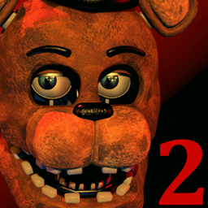

# Five Nights at Freddy's 2: Godot Open Source

This is an open-source Godot project dedicated to faithfully recreating the classic horror game experience of Scott Cawthon's **Five Nights at Freddy's 2**.

## Project Status

This project is under development. Users are encouraged to try it out and keep it alongside the original game. Bug reports are welcome, but please provide as much detail as possible and follow the existing issue templates. Feature requests are also accepted, but let's keep them simple so that we don't deviate too much from the original game's essence.

## Running the Game

If you want to test the project without setting up a development environment, you can consume my [releases](https://github.com/tastyForReal/five-nights-at-freddys-2-godot/releases) here.

## Developing the Game

Before you dive into the code, ensure you have the following prerequisites:

-   A desktop platform with the [.NET 6.0 (or later) SDK](https://dotnet.microsoft.com/en-us/download) installed.
-   [Godot with Mono support](https://godotengine.org/download/windows/)

When working with the codebase, we recommend using an IDE that offers intelligent code completion and syntax highlighting. Some good choices include the latest versions of [Visual Studio](https://visualstudio.microsoft.com/vs/), [JetBrains Rider](https://www.jetbrains.com/rider/), or [Visual Studio Code](https://code.visualstudio.com/) with the [EditorConfig](https://marketplace.visualstudio.com/items?itemName=EditorConfig.EditorConfig) and [C#](https://marketplace.visualstudio.com/items?itemName=ms-dotnettools.csharp) plugin installed.

## Downloading the Source Code

To get the source code, follow these steps:

1. Clone the repository:

```sh
git clone https://github.com/tastyForReal/five-nights-at-freddys-2-godot
cd five-nights-at-freddys-2-godot
```

2. To update the source code to the latest commit, run this command inside the project directory:

```sh
git pull
```

## Acquiring the Image Resources

I cannot directly upload all image resources to GitHub since they are copyrighted materials created by Scott Cawthon. Fortunately, you can obtain them locally by downloading [the free demo here](https://www.indiedb.com/games/five-nights-at-freddys-2/downloads/five-nights-at-freddys-2-demo), or [the full version from Steam of the original game](https://store.steampowered.com/app/332800/Five_Nights_at_Freddys_2/). Then, download [Source Explorer by LAK132](https://github.com/LAK132/SourceExplorer).

After downloading Source Explorer, dump all images and sounds from the EXE file. This will create the output folder inside the current directory containing all resources.

Run the `PrepareResources.ps1` script in PowerShell to organize the resource files for this project.

```
. .\PrepareResources.ps1 -StoredHashes .\hashes.json -DumpedImages "<path-to-fnaf2-root>\<exe-filename>\images\[unsorted]" -OutputDir .
```

When you add or make changes to the resource files, be sure to run `StoreHashes.ps1` before pushing.

**NOTE**: Once you open the Godot project, it should automatically re-import all the files!

## Exporting

Refer to the [Godot documentation](https://docs.godotengine.org/en/stable/tutorials/export/exporting_projects.html) for instructions on how to export this project.

## Credits

Five Nights at Freddy's 2 &copy; 2014 Scott Cawthon. All rights reserved.

[Please consider buying the full version of the game here to support Scott Cawthon!](https://store.steampowered.com/app/332800/Five_Nights_at_Freddys_2/)

## License

This project is licensed under the [MIT license](https://opensource.org/licenses/MIT). Please refer to the [LICENSE file](https://github.com/tastyForReal/five-nights-at-freddys-2-godot/blob/main/LICENSE) for more information. tl;dr - you can do whatever you want as long as the license and copyright information are included.
